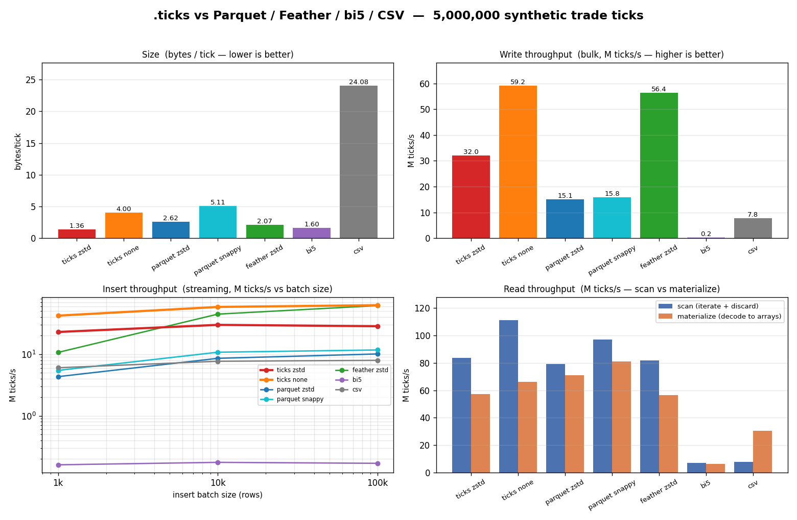

# Benchmarks

A repeatable comparison of `.ticks` against Parquet, Feather (Arrow IPC),
Dukascopy **bi5** (the raw vendor tick format ticksio ingests from), and CSV on
the same synthetic trade stream. Measures **size**, **write**, **insert**, and
**read**, records the raw numbers to [results.csv](results.csv), and renders
[comparison.png](comparison.png).



See [results.md](results.md) for the table form.

## What is measured

The dataset is one deterministic synthetic liquid-stock time-and-sales stream
(monotonic millisecond timestamps with small gaps, a cent-level price random
walk, round-lot volumes). Every format encodes the **identical rows** as three
`int64` columns — `timestamp, price, volume` - so the comparison is
representation-for-representation (ticksio stores price as a scaled integer; the
Parquet/Feather columns match it exactly). The ticks files are verified to
round-trip all N records losslessly before timing. The one exception is bi5,
which by design uses 32-bit fields and a per-file time offset (lossless on this
dataset); see the caveat below.

Every timed metric is reported **best-of-N** (minimum wall-clock over `REPS`
runs, default 3) on **both** sides - the C ticks side and the pyarrow side use
the same rule. A single cold run is dominated by cache/OS jitter; the
steady-state minimum is the honest number. zstd level is **3** on every zstd
path (ticksio's writer, Parquet, Feather), so the size comparison isn't skewed
by mismatched compression effort.

### What best-of-N does *not* fix - read this before quoting throughput

best-of-N removes transient jitter *within* one process. It does **not** remove
run-to-run variance whose cause lives outside the timed region's control. On the
machine these numbers were taken (a hybrid **Lunar Lake** laptop - P-cores +
LP E-cores, no HT, Balanced power plan) the dominant cause was **CPU-side, not
disk**, established by measurement:

- The whole zstd-write cost is in the `add_data` encode/compress loop; `close()`
  (index + header rewrite + `fclose`) is ~0.4 ms, so disk flush / Defender
  on-access scan is **not** where the noise is. Confirmed by an `encode` metric
  (add_data only, no close) whose band is identical to `write`'s.
- **Core migration dominates.** An unpinned single-threaded bench that the
  scheduler parks on a P-core one run and an E-core the next swings ~2×. Pinning
  to one P-core cut zstd-write CV from **12% to 4.4%** and spread from 46% to
  12.5% (and made it faster - it was running partly on E-cores before).
- **CPU clock scaling is the rest.** Balanced -> High Performance on top of
  pinning took CV **4.4% to 2.7%**, spread to 7.5%, and pinned the median at the
  full-clock value.

So the trustworthy-throughput recipe is **pin + high clocks**, not more reps:

- `bench.exe` **pins to one P-core and raises priority by default** (the highest
  `EfficiencyClass` core via `GetLogicalProcessorInformationEx`); set
  `BENCH_NO_PIN=1` to disable. The startup line reports the pinned core.
- Set the **High Performance** power plan while benchmarking
  (`powercfg /setactive 8c5e7fda-e8bf-4a96-9a85-a6e23a8c635c`); on a laptop, on AC.

Two more knobs trim disk-side noise (small here, but free):

- `--no-csv` - skip the ~120 MB `out.csv` write (only the Parquet/Feather side
  needs it; its writeback otherwise bleeds into the next invocation's flush).
- `BENCH_SETTLE_MS=K` - `Sleep(K)` between reps (outside the timed region) so any
  prior writeback drains before the next is timed.

Even with all of that:

- **Bytes/tick, scaling *shapes*, and within-sweep *relative* comparisons are
  trustworthy** - size is deterministic, and every point in a single sweep is
  measured under the same conditions.
- **Absolute throughput is reproducible to ~3% CV when pinned at high clocks, but
  drifts ±20–30% unpinned / across power states.** Do **not** compare an "after"
  number to a stored "before" from another session. Use **`bench/ab.py`**, which
  runs both builds *interleaved in one session* (A,B,A,B,…) so any residual drift
  hits both equally and cancels in the paired delta. Run its A==B noise floor
  first; trust only effects larger than the band it reports. The `encode` metric
  (ticks-only, add_data without close) is the lowest-noise number to optimize
  against; `write` is the to-disk figure kept for the head-to-head vs the others.

| metric | meaning |
|--------|---------|
| **size** | on-disk bytes (reported as bytes/tick) |
| **write** | bulk: encode + write the whole dataset to disk in one call (the to-disk number; head-to-head vs the other formats) |
| **encode** | *ticks-only:* the `add_data` encode/compress path **without** `ticks_close` (no index/header flush, no `fclose`). ~the same as `write` here since close is ~0.4 ms, but it keeps disk entirely out of the timer, so it is the lowest-noise number to **optimize against**. |
| **insert** | streaming: write in batches via the format's incremental writer, **swept across batch sizes (1k / 10k / 100k)** — insert throughput is a function of batch granularity, so the curve is the answer, not a single point. (Parquet/Feather are write-once; this is the closest live-append analog and is labelled as such.) |
| **read — scan** | iterate the file's batches, decode each into native arrays and **discard** (bounded memory, no retained N-sized output). ticksio iterates rows into one reused C struct; the columnar formats iterate batches and drop them. |
| **read — materialize** | decode the **whole** file into contiguous N-sized native arrays and keep them. ticksio fills three N-sized `int64` arrays; the columnar formats `combine_chunks` + `to_numpy` per column. This is the head-to-head "load it all into memory" read. |

The single-N run records the full insert curve and both read modes. The scaling
sweep collapses each to one representative point per N (insert at the 100k batch,
read in materialize mode) to keep the multi-N chart legible.

## Caveats — read these before quoting the numbers

- **One synthetic dataset.** The shape is realistic but favourable to delta
  encoding. Jumpier data (wide-swing crypto, illiquid names) narrows the size
  gap. Re-run with your own data to get numbers that matter to you.
- **Different harnesses.** ticksio is timed in C; Parquet/Feather/CSV in pyarrow
  (C++ under Python). Both are native code, but the harnesses differ — treat the
  throughput bars as order-of-magnitude, not a photo finish.
- **Not apples-to-apples on features.** `.ticks` is a fixed-schema, purpose-built
  tick format. Parquet/Feather are general-purpose columnar formats carrying
  overhead for things ticksio doesn't do (arbitrary/nested schemas, per-column
  predicate pushdown, broad ecosystem). "Smaller for tick data" ≠ "better
  format."
- **bi5 is modelled, not byte-exact.** Real Dukascopy `.bi5` is a 5-field
  big-endian quote record (ms-offset, ask, bid, ask/bid volume), LZMA-compressed
  one file per hour. This bench is a *trade* stream, so the bi5 point applies
  that same strategy — fixed-width big-endian records + whole-file LZMA, with a
  32-bit per-file time offset — to the identical trade rows the other formats
  encode (lossless here). It captures bi5's row-wise + LZMA cost on this data,
  not the exact vendor bytes. LZMA's slow write/insert is a real property of the
  format. (Uses Python's stdlib `lzma`, so it adds no extra dependency.)

## Running it

Requires the built library (`build/c/libticksio.a` + the fetched
`libzstd.a`), a C compiler, and Python with `pyarrow`, `numpy`, `matplotlib`.

First build the ticks side once:

```sh
gcc -O2 -Isrc/c/include bench/bench.c build/c/libticksio.a \
    build/c/_deps/zstd-build/lib/libzstd.a -o bench/bench.exe
```

Then drive everything through the unified harness `bench/run.py`:

```sh
python bench/run.py single 5000000 --high-perf   # comparison.png + results.md + results.csv
python bench/run.py scaling --high-perf           # full sweep -> scaling.csv + scaling.png
python bench/run.py all --high-perf               # sweep, then the single-N comparison
python bench/run.py plot                          # re-render both charts, no timing
```

`--high-perf` sets the Windows High Performance power plan for the run and
**restores your previous plan afterward** (even on error / Ctrl-C); combined with
`bench.exe`'s default P-core pinning that's the full trustworthy-throughput recipe
(see the best-of-N caveat above). `--reps N` sets best-of-N on both sides.

`run.py` is a thin orchestrator; the underlying steps still work standalone:

```sh
./bench/bench.exe 5000000     # ticks side -> results.csv + out.csv. 2nd arg = REPS (default 3)
                              # --no-csv skips out.csv; BENCH_SETTLE_MS=K settles between reps;
                              # pins to a P-core by default (BENCH_NO_PIN=1 to disable)
python bench/bench_py.py      # Parquet/Feather/bi5/CSV on the identical rows; appends to results.csv
python bench/chart.py         # render comparison.png + results.md
```

`bench.exe` must run before `bench_py.py` (it writes both the shared `out.csv`
and the header row of `results.csv`; the Python side appends to it).

## Scaling sweep

The single-N run above is a snapshot. To see how each format behaves as the
stream grows — does bytes/tick stay flat, does throughput fall off at large N —
run the sweep, which repeats the whole comparison across a range of row counts
and renders [scaling.png](scaling.png): a 2x2 of size + write/insert/read, each a
multi-line chart (one line per format) against N on a log axis.

```sh
python bench/scaling.py              # full geometric sweep (100k .. 10M), then render
python bench/scaling.py 1e5 1e6 1e7  # custom row counts
python bench/scaling.py plot         # re-render scaling.png from existing scaling.csv
```

The sweep shells out to `bench.exe` once per N (build it first, step 1 above) and
writes the tidy per-N numbers to [scaling.csv](scaling.csv). The `plot` mode
re-renders from that CSV without re-timing.

## Comparing an optimization (A/B)

The comparison and scaling charts answer "how does `.ticks` stack up"; they are
**not** the tool for "did my change make ticks faster." Absolute throughput
drifts ±20–30% between sessions (see the best-of-N caveat above), so a stored
baseline is worthless for a 10–15% change. Use `bench/ab.py`, which runs two
builds **interleaved in one session** so the drift cancels in the paired delta:

```sh
python bench/ab.py                              # A==B: noise floor (min detectable effect)
python bench/ab.py --a old.exe --b new.exe      # compare two builds
python bench/ab.py --metric "ticks zstd:write" --n 5000000 --rounds 12
```

It reports each side's median + run-to-run band and the per-round paired delta
with a verdict. Run the **noise floor** (`--a` and `--b` the same binary) first:
the ±% band it reports is the smallest improvement you can trust this session —
anything inside it is noise. `--metric` is `format:metric[:variant]`, e.g.
`ticks none:read:scan` or `ticks zstd:insert:100000`. Each invocation uses
`--no-csv` and a settle, so the residual band is as tight as the harness allows.
